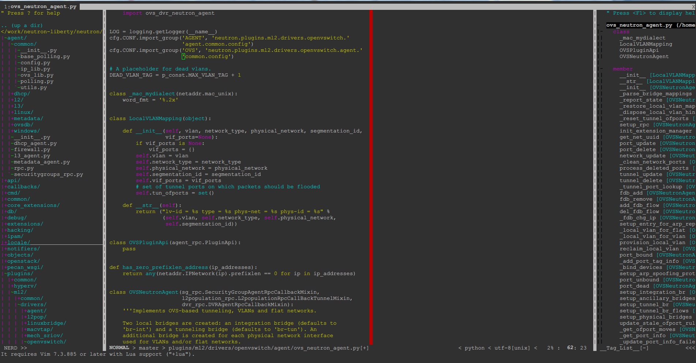

vim_awesome
===========

my vim configuration, based on amix's project (https://github.com/amix/vimrc).

screen shots:

Ubuntu:

  

Windows:

  

---------

# install
```shell
# backup your old configuration files
cd ~
mkdir vimback
mv .vim* vimback

# clone configuration files
git clone --depth 1 https://github.com/ArthurChiao/vim_awesome.git

# move files to home directory
cd vim_awesome
mv .vim* ~

# install
sh ~/.vim_runtime/install_awesome_vimrc.sh
```

# dependencies
## Ubuntu
the following tools are used by the configuration:
```shell
# ctags
sudo apt-get install ctags
```

## Windows
download `ctags.exe`, put it into `C:\Windows\System32\`.

# Problem Fixups
## 1. neocomplete
If you encountered `neocomplete` problems at vim startup, it may be that 
your vim version is under 7.4, or it is not `lua` enabled (test it with 
`:echo has("lua")`.

To fix this problem, please see the solutions provided in
https://github.com/Shougo/neocomplete.vim.git

One simple/lazy solution is to install `gvim`, which includes `lua` by default:
```shell
sudo apt-get install vim-gtk
```
Restart your vim, the `neocomplete` should be ok.

If none of the solutions in the above link fits your case, just remove the 
`neocomplete` plugin:
```shell
rm .vim_runtime/sources_forked/neocomplete.vim -rf
```
restart the vim.

Or, you can use `neocomplcache`, an alternative to `neocomplete`. Enable this
plugin by opening the flag in `~/.vim_runtime/vimrcs/plugins_config.vim`:

```shell
" enable neocomplcache
" this is an alternative word-completion plugin if you can not use
" neocomplete, which needs lua enabled
let g:neocomplcache_enable_at_startup = 1 # enable this flag
```

## 2. can not load custom colorschemes on windows

If your `vim` on windows can not load the colorschemes in `~/.vim/colors`,
just copy them to the `<your vim install dir>/colors/`, e.g, `c:/vim74/colors/`.
Restart vim.

# Cheat sheet
[cheat sheet](cheat-sheets/)

[cheat sheet 中文版](cheat-sheets/cn-zh/)
