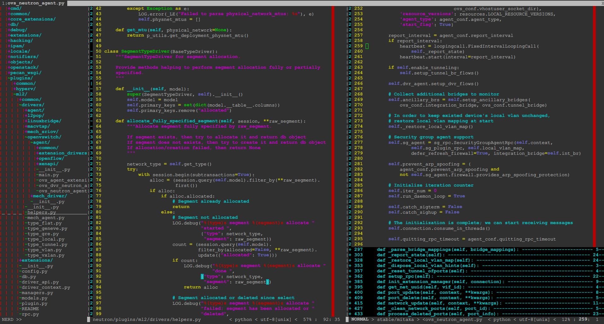
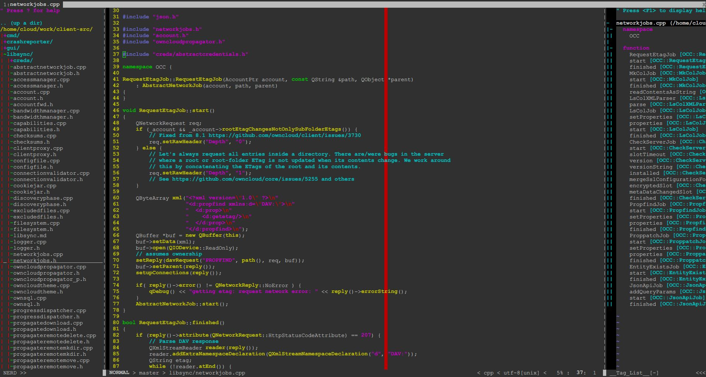
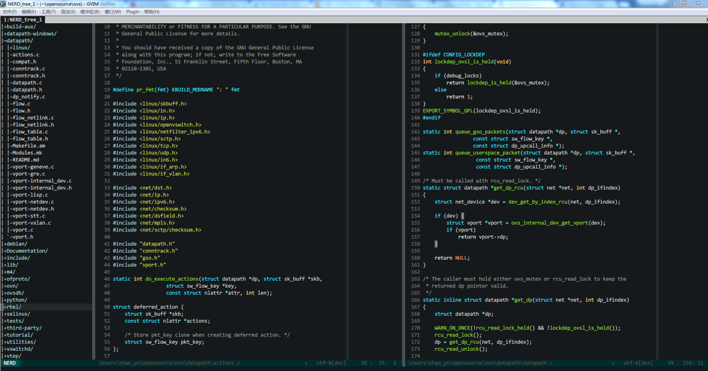
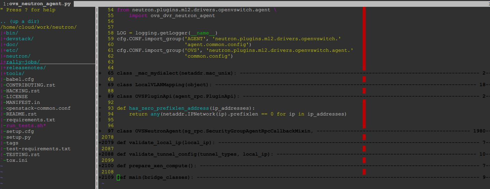

vim_awesome
===========

**Index:**

1. [About](#about)
1. [Supported Platforms](#supported_platforms)
1. [Install](#install)
1. [FAQ](#faq)

---------------

<a id="about"></a>
# About

My vim configuration, originally derived from
[amix's project](https://github.com/amix/vimrc).

screen shots:

Ubuntu:

  
  

Windows:

  


<a id="supported_platforms"></a>
# Supported Platforms
This configuration is best suitable for vim **7.4+**. However, it could also
be used with vim under this version - just disable those features that causing
errors at vim start (comment them out).

Tested workable on the following platforms:

* **Ubuntu** 12.04, 14.04

* **RedHat** 6.7, 7.1

* **Centos** 6.7, 7.1

* **openSUSE** 13.2

* **Windows** win7


<a id="install"></a>
# Quick Install
Auto scripts for install/uninstall, but I only tested under limited platforms:
```shell
$ git clone --depth 1 https://github.com/ArthurChiao/vim_awesome.git

$ cd vim_awesome

$ ./install.sh
$ ./uninstall.sh
```

# Custome Install
Tested on **Ubuntu/Redhat/CentOS/OpenSUSE/Windows/** platforms.

For windows users, you need a bash, such as, `cygwin`, `mingw`, or like what
I used, `git bash`, which is installed along with `git`.

```shell
# it's better to backup your old configuration files
$ cd ~ && mkdir vimback && mv .vim* vimback -rf

# clone repo
$ git clone --depth 1 https://github.com/ArthurChiao/vim_awesome.git

# copy files to home directory
$ cd vim_awesome && cp .vim_runtime ~ -rf

# install
$ sh ~/.vim_runtime/install_awesome_vimrc.sh
```


# Dependencies
Some dependencies are needed to enable the full-feature of the configuration.
You may need to install them manually if they are not there. However, you
could also choose to ignore them, just disable the features when vim report
errors at the configuration file `error: at line xxx in file xxx`.

## Ubuntu
the following tools are used by the configuration:
```shell
# install ctags
$ sudo apt-get install ctags

# install vim-gtk, this enables `neocomplete`, one of the most powerful
# auto completion plugin
$ sudo apt-get install vim-gtk
```

## RedHat & CentOS
```shell
# install ctags
$ sudo yum install ctags
```

## openSUSE
```shell
$ sudo zypper install ctags
```

## Windows
download `ctags.exe`, put it into `C:\Windows\System32\`.

`neocomplete` needs lua enabled when gvim is compiled. Otherwise, it doesn't
work (but reports no errors).

<a id="faq"></a>
# FAQ
## 1. neocomplete
If you encountered `neocomplete` problems at vim startup, it may be that 
your vim version is under 7.4, or it is not `lua` enabled (test it with 
`:echo has("lua")`.

To fix this problem, please see the solutions provided in
https://github.com/Shougo/neocomplete.vim.git

One simple/lazy solution is to install `gvim`, which includes `lua` by default:
```shell
sudo apt-get install vim-gtk
```
Restart your vim, the `neocomplete` should be ok.

If none of the solutions in the above link fits your case, just remove the 
`neocomplete` plugin:
```shell
rm .vim_runtime/sources_forked/neocomplete.vim -rf
```
restart the vim.

Or, you can use `neocomplcache`, an alternative to `neocomplete`. Enable this
plugin by opening the flag in `~/.vim_runtime/vimrcs/plugins_config.vim`:

```shell
" enable neocomplcache
" this is an alternative word-completion plugin if you can not use
" neocomplete, which needs lua enabled
let g:neocomplcache_enable_at_startup = 1 # enable this flag
```

## 2. can not load custom colorschemes on windows

If your `vim` on windows can not load the colorschemes in `~/.vim_runtime/colors`,
just copy them to the `<your vim install dir>/colors/`, e.g, `c:/vim74/colors/`.
Restart vim.

## 3. for python coders
If you open an existing python file, you will find that all
functions/classes are folded, it may embrass you at the scene, like the
following,



here are some quick remedies:

* `za` - toggle to open/close current folding
* `zR` and `zM` - open/close all foldings in current file

This is resulted by the default settings of `PythonMode` plugin. If you do not
like it, you could just remove it by deleting the
`~/.vim_runtime/sources_forked/python-mode/` folder in your host, and restart vim.
However, i highly recommand you to get familir with this tool, which can
accelerate your python developing by great extent.

# Cheat sheet
[cheat sheet](cheat-sheets/)

[cheat sheet 中文版](cheat-sheets/cn-zh/)
